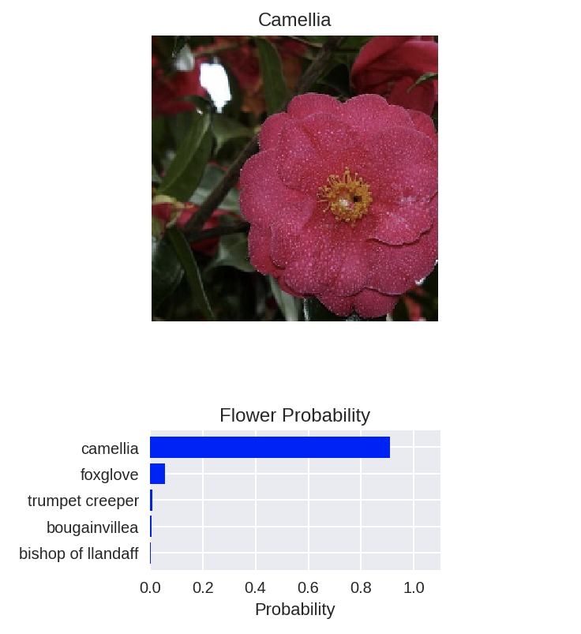

# PyTorch Image Classifier

## About 

* As the final part of the Facebook AI scholarship challenge, I built a deep learning image classifier from scratch that uses computer vision to identify different species of flowers.

* The data set contains images of flowers from 102 different species curated by Oxford University. Which consist of a training set and a validation set. You can download the images from [here](https://s3.amazonaws.com/content.udacity-data.com/courses/nd188/flower_data.zip) or directly from the server using the links provided in the notebook. To test the model's accuracy using other images you will need to save the images on a test folder inside the `flower_data` folder.

* My final model was able to accurately classify the flowers 90% of the time. Below is an output of my model after you pass an image through it.

### The project is broken down into multiple steps:

* Load and preprocess the image dataset. 
* Train the image classifier on your dataset - `train.py` is a script that trains a deep neural network on the given data directory, with command-line options.
* Use the trained classifier to predict image content - `predict.py` is a script that predicts the flower name from an image, along with the probability of that name, given a trained classifier.

### Dependencies

    $ Python 3.5.2
    $ pytorch = 0.4.1

### Installation
    $ git clone https://github.com/hassifow/PyTorch-Image-Classifier
    $ cd PyTorch-Image-Classifier
    $ git status
   
### Author

   * **Hassif Abdulahi Mustafa** 

